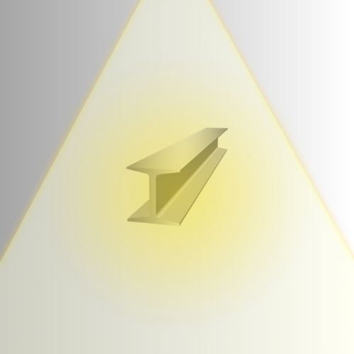
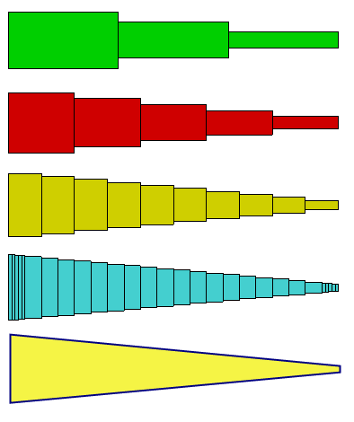

# BeamMeUpScotty

<p align="center">

</p>

BeamMeUpScotty is a 2D structural analysis tool developed in Python. It enables users to model, analyze, and visualize **trusses** and **beams**.

## Features

### Structural Analysis Capabilities

- **2D Analysis of Truss and Beam Structures**:  
  Analyze trusses (axial force only) and Euler-Bernoulli beams (bending and shear). 

- **Material Properties**:  
  Define Young's modulus, cross-sectional area, and moment of inertia for each element.

- **Boundary Conditions**:  
  Apply various support types (fixed, roller, pinned) and external loads (point loads, distributed loads, moments).

- **Numerical Approximation Solver**:  
  Assembles global stiffness matrices, applies input boundary conditions, and solves for nodal displacements using **numerical methods**.

### Visualization

- **Structure Plotting**:  
  Visualize undeformed and deformed structures.

- **Force Diagrams**:  
  Generate shear force and bending moment diagrams for beams and frames.

- **Interactive Interface**:  
  User-friendly interface for model creation and result interpretation.

## Planned Features

- **Solver for Beams with Varied Cross Sections**  
  Enhance beam analysis to handle beams with varying cross-sections and complex loading.

<p align="center">

</p>

## Installation

1.  **Clone the repository:**
    ```bash
    git clone <repository-url>  # Replace <repository-url> with the actual URL
    cd BeamMeUpScotty
    ```

2.  **Create a virtual environment (recommended):**
    ```bash
    python -m venv venv
    source venv/bin/activate  # On Windows: venv\Scripts\activate
    ```

3.  **Install dependencies:**
    Make sure you have Python 3 installed. Tkinter is usually included with Python. If not, you may need to install it separately (e.g., `sudo apt-get install python3-tk` on Debian/Ubuntu).
    ```bash
    pip install -r requirements.txt
    ```

## Usage

To run the application, navigate to the project directory and execute the `gui.py` script:

```bash
python gui.py
```

### Basic Workflow:

1.  **Add Nodes**: Select "Add Node" mode and click on the canvas to place nodes.
2.  **Add Elements**: Select "Add Element" mode. 
    *   Click on an existing node to start an element.
    *   Click on another existing node to finish the element, or click on an existing element to split it and connect to the new node.
3.  **Define Material & Section**: 
    *   Use the "Material & Cross-Section" panel to define material properties (Young's Modulus E) and section properties (Area A, Moment of Inertia I).
    *   Click "Add New Properties" to create custom materials/sections or select from predefined ones.
    *   Select an element from the dropdown and click "Apply to Selected Element" or "Apply to All Elements".
    *   To model truss behavior, define a beam element with a Moment of Inertia (`I`) of zero or near-zero.
4.  **Apply Loads**: 
    *   Select a node in the "Node Load" section.
    *   Enter Fx, Fy, and/or Moment values (units are N and N·m by default, can be changed).
    *   Click "Add/Update Load".
5.  **Apply Boundary Conditions (Supports)**:
    *   Select a node in the "Boundary Conditions" section.
    *   Choose a BC type (Fixed, Pinned, Roller-X, Roller-Y, or Custom).
    *   Click "Apply Boundary Condition".
6.  **Solve**: Click the "Solve" button in the "Results" section.
7.  **View Results**:
    *   Click "Plot Deformed" to see the deformed shape.
    *   Click "Identify Zero-Force Members" to highlight them (for truss-like structures).
    *   Export a PDF report using the "Export PDF" button. The report includes input data, undeformed/deformed plots, reactions, axial forces, and SFD/BMD for beam-like elements.

### Controls:

*   **Mouse Wheel**: Scroll the control panel.
*   **Right-Click + Drag on Plot**: Pan the view.
*   **Middle-Click on Plot (during element creation)**: Cancel the current element placement.
*   **Zoom Buttons**: Zoom in/out or reset the plot view.
*   **Undo/Redo**: Revert or reapply recent actions.

## Requirements

The application requires Python 3 and the following libraries:

*   **NumPy**: For numerical operations (`pip install numpy`).
*   **SciPy**: For solving linear systems (`pip install scipy`).
*   **Matplotlib**: For plotting structures and results (`pip install matplotlib`).
*   **Tkinter**: For the graphical user interface (usually included with Python standard library. If not, installation depends on your OS, e.g., `sudo apt-get install python3-tk` for Debian/Ubuntu).

A `requirements.txt` file is provided for easy installation of Python packages:
```bash
pip install -r requirements.txt
```

## License

MIT License

Copyright (c) [Year] [Your Name/Organization]

Permission is hereby granted, free of charge, to any person obtaining a copy
of this software and associated documentation files (the "Software"), to deal
in the Software without restriction, including without limitation the rights
to use, copy, modify, merge, publish, distribute, sublicense, and/or sell
copies of the Software, and to permit persons to whom the Software is
furnished to do so, subject to the following conditions:

The above copyright notice and this permission notice shall be included in all
copies or substantial portions of the Software.

THE SOFTWARE IS PROVIDED "AS IS", WITHOUT WARRANTY OF ANY KIND, EXPRESS OR
IMPLIED, INCLUDING BUT NOT LIMITED TO THE WARRANTIES OF MERCHANTABILITY,
FITNESS FOR A PARTICULAR PURPOSE AND NONINFRINGEMENT. IN NO EVENT SHALL THE
AUTHORS OR COPYRIGHT HOLDERS BE LIABLE FOR ANY CLAIM, DAMAGES OR OTHER
LIABILITY, WHETHER IN AN ACTION OF CONTRACT, TORT OR OTHERWISE, ARISING FROM,
OUT OF OR IN CONNECTION WITH THE SOFTWARE OR THE USE OR OTHER DEALINGS IN THE
SOFTWARE. 
